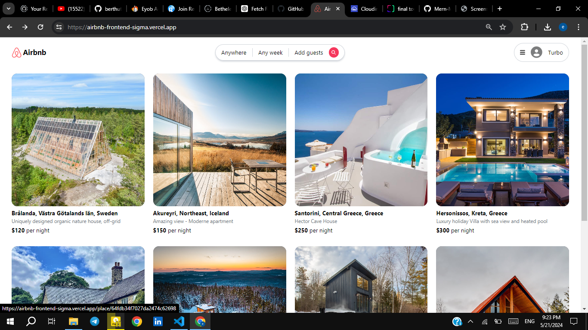
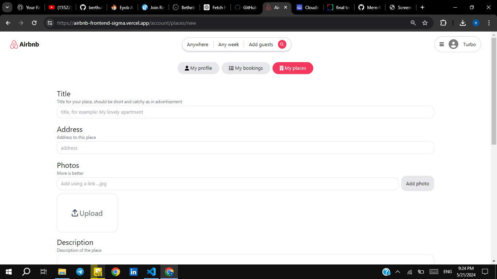
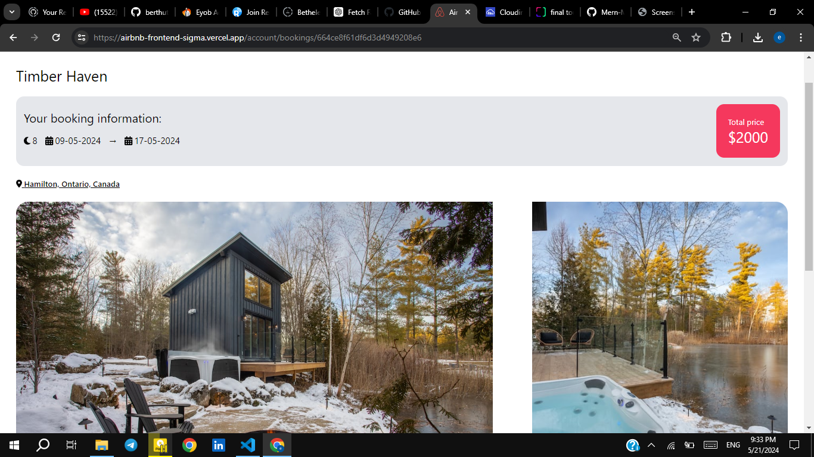
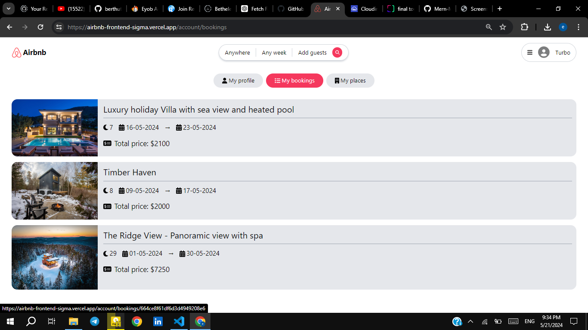
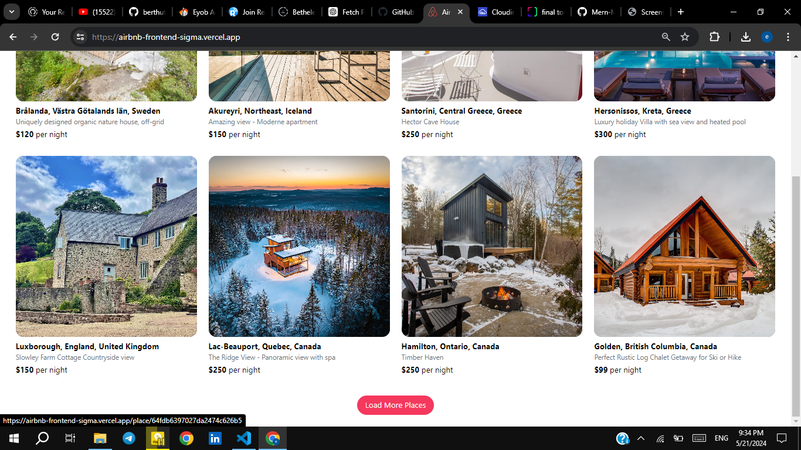

Airbnb Clone

Description
This project is a clone of Airbnb built using the MERN stack (MongoDB, Express.js, React.js, Node.js). 
It aims to replicate the core functionality of Airbnb, allowing users to browse, search, and book accommodations.

